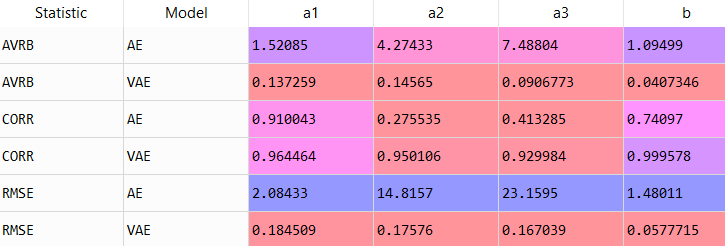
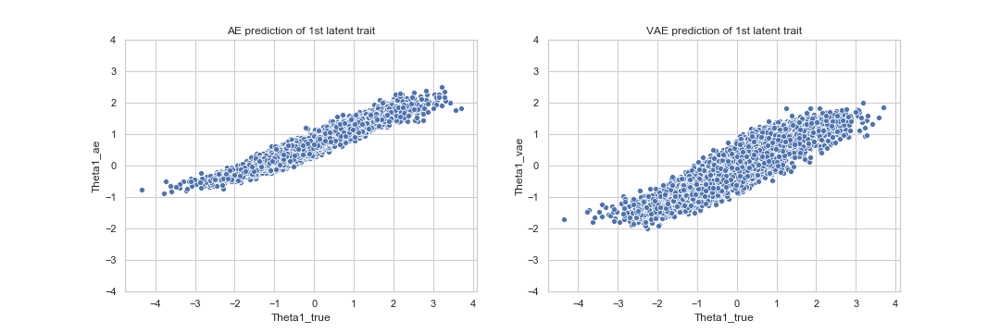

# Exploration of Learner Data with VAEs
Given student test scores, can a machine understand with granularity what a student knows about a given subject?  If a student scores an 65 on a trig test, does the student not understand the trigonometry, or just the algebra behind the trig?  "Autoencoders for Educational Assessment" by Converse, et al., found a way to automate the process of finding latent student knowledge using Variational Autoencoders.  Through integrating the variational autoencoder with some outside information, the authors were able to obtrain strong estimates for ground truth student knowledge.  Moreover, they were able to uncover exactly how the tests themselves were formed were great precision.  

This github repository is devoted to reproducing the findings of "Autoencoders for Educational Assessment" and extending the research of the paper.  The first part of this will focus on my replication.  Following this, I will present several questions that I have answered concerning the architecture and data consumptions of the VAEs.  After this, I will present future areas for the next teams to tackle.    

## Replication of the Study
Using Tensorflow, I was able to recreate the paper.  The general results were the same, though some of the specifics had changed.  This is not surprising, as the data are generated by stochastic processes.  
The first table of the paper illustrates the difference in parameter recovery between variational autoencoders (VAEs) and autoencoders (AEs).  a_1,a_2,a3,b are all parameters used to generated test questions.  

Clearly, a variational autoencoder recovers the parameters of the test better than an autoencoder.  This can be seen visually
from a plot of the recreations of the VAE and AE of the test data.

It is clear that the VAE much more clearly correlates with the unobserved ground truth used to create the test.  Even more striking is the recovery of the difficulty parameter b.  As seen below, the VAE correlates almost perfectly with the ground truth of question difficulty.

The second table shows a VAE and an AE recovering the students' knowledge of a subject.

While the VAE has less error in terms of AVRB and RMSE, the AE correlates between with the student knowledge.  The graph below illustrates this is the plots of the estimated knowledge with the actual student knowledge.  

The autoencoder has a strong linear relationship with the true values, but is constrained.  The autoencoder has only rarely assignes someone a score of greater than 1 or less than -1.  The VAE, on the other hand, struggles less with assigning higher or lower scores.  It is less compact than the autoencoder, relating the lower correlation.  Thus the VAE does better with RMSE or absolute error, but has slightly poorer correlation scores than the autoencoder.  

## Extensions 

The paper investigated whether a VAE could outperform and AE in terms of reconstructing the test and understanding student knowledge.  Building on this approach, a similar question is whether a change in VAE architecture would change either of the above.  The network used in the paper had only one hidden layer with a sigmoid activation.  It did not employ any regularization, such as dropout, and it did not have more modern activations.  I created many networks with varying levels of compexity to test the if any factors affected the performance in detecting student knowledge.  

The first factor tested was activation.  I had the base network described in the paper, with the only modification being that I changed the inner activation from sigmoidal to either tanh or relu.  I ran twenty networks of each to test differences.

Insert Graph Here

After looking through the results, blah blah blah...

The second thing I looked at was whether architecture would make the networks better detect the student understanding.  I tested the original network again a network with 2 hidden layers and one that had 3 hidden layers.  All networks used relu activations.  Adding more layers gives the network more flexibility to better encode the data.  Unfortunately, adding more layers adds more parameters to the model and can stymie learning.  

picture of thingy

As you can see, ...

I finally tested if dropout regularization would improve accuracy. Dropout regularization can lead to dramatic improvements in accuracy in classification problems, so I guessed that it would improve the student knowledge during training. 

picture of dropout 

As it turns out,  findings of dropout network running....

Conclusions: From the testing that has been done above, a good choice in networks is ...
## Future Work

There are several extensions that can be taken to the current work.  One is to have the VAE deal with correlated data.  If you take a test that assesses reading and writing, both traits are somewhat correlated.  One's reading ability affects one's writing ability, and vice versa.  If the underlying distribution of the VAE does not reflect this correlation, something is missing from our understanding of the tests.  This problem can be address by using a MVN as the hidden distribution for the VAE.  Currently, the VAE uses independent normals to generate the data.  

Another extension could be to let the VAE deal with hierarchical latent skills.  Some skills are dependant on other skills.  For instance, a difficult probability problem often entails many other knowledges than just probability.  You may need Calculus or Linear Algebra to solve the probability problem. The knowledge of probability is built ontop of other knowledges.  A useful extension of the current work would be to code this out.  I have done the theoretical work for the project in the "Some Technical Details" pdf under latex.  The final section of this document details how to derive those equations.  
